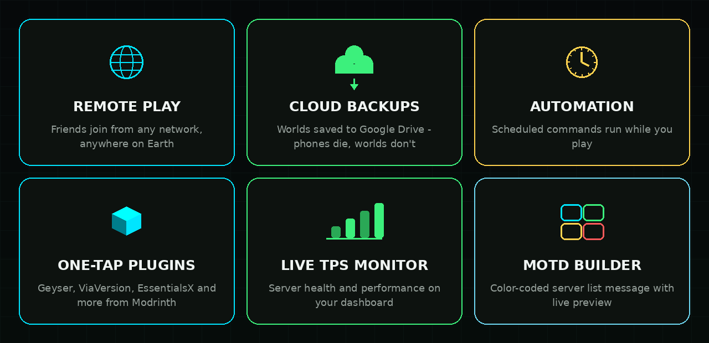

### Your server. Your pocket. Your rules.

**A real Minecraft Java Edition server — running on your phone.**

No PC · no renting · no queue · your phone *is* the server.
Friends on the same Wi-Fi or hotspot join directly — and with **Remote Play**,
friends in other cities join too. No port forwarding. No PC. Ever.

 

---

## ⚡ The v4 toolkit

| | |
|---|---|
| ⛏ **Real Paper server** | A full Minecraft Java server (1.21+) running on-device — not a proxy, not an emulator |
| 📦 **One-tap server JAR** | Paper, Vanilla or Fabric — the app fetches the latest official build for your version. No browser, no file picker |
| 🌍 **Remote Play** | Free playit.gg tunnel built in — friends join from **any network on Earth** |
| 🩺 **Tunnel doctor** | One-tap DIAGNOSE: pings playit's control servers over UDP and tells you exactly why a tunnel is down |
| ☁️ **Cloud backups** | Ship your worlds to Google Drive with one tap — phones die, worlds don't |
| ⏰ **Automation** | Schedule console commands (nightly saves, restarts) that run while you play |
| 🧩 **One-tap plugins** | Geyser, ViaVersion, ViaBackwards, Floodgate, LuckPerms, EssentialsX — straight from Modrinth, always the latest build for your loader |
| 📈 **Live TPS monitor** | Real server health stats on your dashboard — know about lag before your players do |
| 🎨 **MOTD builder** | Color-coded server list message with live preview |
| 🌍 **World transfer** | Copy worlds between server profiles in-app |
| 🖥 **Live console** | Read logs, run any command, watch players join in real time |
| 🌐 **Web dashboard + live map** | Open `http://<phone-ip>:8765` in any browser on your network |
| 🗺 **World manager** | Import / export worlds & datapacks, set seeds, switch active world |
| 👥 **Player manager** | OP, kick, give XP, gamemode, effects, ban / unban |
| 📡 **LAN broadcast** | Your server appears in every Java client's *"Scanning for games on your local network"* list |
| 🔗 **QR join code** | Friends scan & connect — no typing IPs |
| 📱 **Widget + join alerts** | Server status on your home screen, pings when someone joins |
| 🎮 **Bedrock support** | Phone / console players join with their Xbox gamertag via Geyser |

## 🚀 Quick start

1. **Install** — grab the APK from [Releases](https://github.com/nexusrailer432/LANCRAFT/releases) and open it. Android will warn about unknown apps: **More details → Install anyway** (normal for anything outside the Play Store — same as Termux / PojavLauncher)
2. **Tap DOWNLOAD RUNTIME** — the app pulls its Java 21 runtime from this repo with one tap
3. **Create a profile** — name, version, RAM (1536 MB is a good default on 4 GB phones)
4. **Tap DOWNLOAD SERVER JAR** — pick **Paper**, **Vanilla** or **Fabric** and the app fetches the latest official build for your version (you can still import your own `.jar` if you prefer). Accept the EULA
5. **START** — watch the console come alive. Players join `<phone-ip>:25565`, pick the server from the LAN tab, or enable **Remote Play** for a public address that works from anywhere

> Why tap-download instead of bundling? Mojang's licensing doesn't let anyone redistribute their files. The JAR is fetched from the official PaperMC / Mojang / Fabric APIs the moment you tap — LANCRAFT never bundles them.

## 🌍 Remote Play — friends from anywhere

LAN-only servers are yesterday's news. Enable Remote Play and LANCRAFT runs a free [playit.gg](https://playit.gg) tunnel alongside your server:

1. **Network tab → ENABLE REMOTE PLAY** — a claim page opens; sign in at playit.gg (Google or email, free — **verify your email**, unverified accounts can't create tunnels) and tap **Approve**
2. **Create the tunnel** — in the playit dashboard: **Setup → New Tunnel** → name it → type **Minecraft Java** → leave the endpoint default → create. Local port 25565 is already correct
3. **Share the address** — the public address (something like `xxx.gl.at.ply.gg:12345`) appears in the app's Remote Play card, the QR code and the console. Friends use it in *Multiplayer → Direct Connect* from anywhere on Earth
4. **If the agent shows offline on playit.gg** — tap **🩺 DIAGNOSE** in the Remote Play card. It checks the tunnel daemon, pings playit's control servers over UDP and tells you exactly what's wrong. The most common cause is a **VPN blocking UDP** — turn it off, restart the server. Also check you created the tunnel under the agent DIAGNOSE reports (old agents from earlier testing can linger in the dashboard)

Works for both the free tier and premium. LAN play stays fully functional either way.

## 🆓 Free vs 💎 Premium

| Feature | Free | 💎 Premium |
|---|:---:|:---:|
| Hosting, worlds, plugins, console, QR join, LAN broadcast, widget | ✅ | ✅ |
| 🌍 Remote Play — friends join from any network | ✅ | ✅ |
| 📦 One-tap server JAR (Paper / Vanilla / Fabric) | ✅ | ✅ |
| 🧩 One-tap plugin installs (Modrinth) | ✅ | ✅ |
| 🖥 Web dashboard + live map (on your network) | ✅ | ✅ |
| 🎮 Bedrock players (Geyser + Floodgate) | ✅ | ✅ |
| **Offline mode — any name works** (TLauncher, SKLauncher, Pojav…) | ❌ | ✅ |
| **Fully-offline hosting** — hotspot play, no internet needed at start | ❌ | ✅ |
| ☁️ Cloud backups to Google Drive | ❌ | ✅ |
| ⏰ Scheduled tasks (auto saves, restarts, messages) | ❌ | ✅ |
| 🎨 MOTD builder with live preview | ❌ | ✅ |
| 🌍 World transfer between profiles | ❌ | ✅ |
| 📈 Live TPS performance monitor | ❌ | ✅ |
| 🌐 Remote web dashboard (control from any browser) | ❌ | ✅ |
| Price | **₹0 forever** | ₹29 / mo · ₹99 / 6 mo · ₹149 / yr · ₹249 **lifetime** |

Keys are verified **offline** — signed keys, no license server, no tracking.

➡️ Get one in our [Discord](https://discord.gg/rjykaH9nUu).

## 🎮 Bedrock players & plugins

- **Offline mode (Premium)** — tap INSTALL on Geyser in the Mods tab, done. Bedrock joins on port 19132 with just a gamertag
- **Online mode (Free)** — also install Floodgate so Bedrock players join without a Java account (name shows a `.` prefix)
- **Version mismatch** — ViaVersion + ViaBackwards let older / newer clients in

All of them install with **one tap** from the **Mods** tab inside the app — matched to your server's loader and version.

## ❓ FAQ

<b>Play Protect blocked the install</b>

Tap **More details → Install anyway**. LANCRAFT isn't on the Play Store because it runs a real server process — Play policy doesn't allow that (it's why Termux isn't there either). The release APK is signed; installs are safe.

<b>Why doesn't the app bundle the server JAR and runtime?</b>

Mojang's licensing forbids redistributing their software. LANCRAFT ships none of their files — the JAR is fetched from official APIs the moment you tap. (The Java runtime we fetch is our own packaging of open-source builds, so one tap is fine there.)

<b>playit says my agent is offline</b>

Tap **🩺 DIAGNOSE** in the Remote Play card — it checks the daemon, the relay, the playit API and pings playit's control servers over UDP, then tells you exactly what's wrong (also posted to the console). Most common cause: a **VPN on the phone blocking UDP** — turn it off and restart the server. The daemon also auto-restarts itself now if it dies while the server runs.

<b>Will my phone survive this?</b>

A phone is a modest server — vanilla / Paper with a handful of friends works well. It runs warm: keep it charging, out of a case, and off your pillow 🙂

<b>Does Remote Play cost money?</b>

No — playit.gg's free tier covers personal use. LANCRAFT's Remote Play itself is free for everyone, free-tier and premium alike.

<b>Can it run 24/7?</b>

Only while the phone is on, charging, and LANCRAFT is running. That's the deal with hosting on a phone.

## ⚖️ Legal

LANCRAFT is **not affiliated with Mojang Studios or Microsoft**. Minecraft is a trademark of Mojang Studios. LANCRAFT ships none of Mojang's files — you import your own runtime, server JAR, and own legitimate copies of the game. Minecraft EULA acceptance is required and enforced.

## 💬 Community

Questions, plugin help, premium keys:

---

LANCRAFT — your server, your pocket, your rules.

